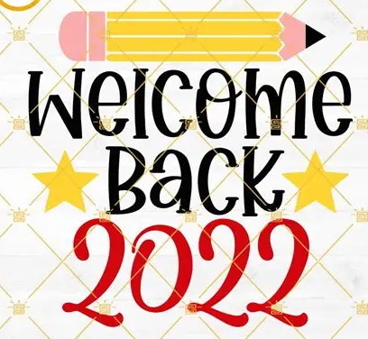

# Event_Invitation

## Objective
To design a **visually appealing event invitation** using basic HTML elements and CSS for layout, structure, and presentation.
## Tasks Completed
### 1. Set Up the HTML Document
- Used `<!DOCTYPE html>`, `<html>`, `<head>`, `<title>`, and `<body>`.
- Set the title to **"Event Invitation"**.

#### CSS Styling:
- Background color set to light beige (`#fdf6e3`).
- Applied `font-family: sans-serif;` for clean typography.

### 2. Create the Invitation Container
- Used a `<div>` with class `.invite-card` to wrap content.

#### CSS Styling:
- Applied `width`, `padding`, `border-radius`, and `box-shadow`.
- Centered the card using `margin: auto` and `margin-top`.

### 3. Add Event Title and Subtitle
- Used `<h1>` for event name: **Annual Alumni Meet 2025**.
- Used `<h3>` for subtitle: **In Remembrance of the Spirited Journey**.

#### CSS Styling:
- Center-aligned headings.
- Used custom colors for emphasis.

### 4. Insert Date, Time, and Venue
- Used `<p>` tags to display:
  - **Date:** July 10, 2025
  - **Time:** 1 PM onwards
  - **Venue:** Nalli hall

#### CSS Styling:
- Bolded the labels using `<strong>`.
- Text aligned and spaced using margins/padding.

### 5. Add an Image or Banner
- Used `` for decorative event banner/logo.

#### CSS Styling:
- Applied `max-width: 100%`, `border-radius`, and center alignment.

### 6. Add RSVP or Contact Info
- Included inside a `<footer>` section:
  - RSVP Name
  - Contact Number
  - Email ID
### HTML FILE:
```
<!DOCTYPE html>
<html lang="en">
<head>
    <meta charset="UTF-8">
    <meta name="viewport" content="width=device-width, initial-scale=1.0">
    <title>Event Invitation</title>
    <link rel="stylesheet" href="styles.css">
</head>
<body>
    <div class="Outerdiv">
        <div class="invite_card">
            <div>
            <h1>Annual Alumini Meet</h1>
            <h3>Reconnect & Celebrate Together</h3>
            </div>
        </div>
        <div class="dtv">
            <div>
                <p><strong>Date :</strong> August 25,2025</p>
                <p><strong>Time :</strong> 6.00pm onwards</p>
                <p><strong>Venue :</strong> College Auditorium</p>
            </div>
        </div>
        

        <footer>
            <p>Contact Name : Rohith</p>
            <p>Phone Number : XXXXXXXXXX</p>
            <p><a href="Event Invitation">RSVP Link</a></p>
        </footer>
    </div>
</body>
</html>
```

## CSS Code:
```
body{
    background-color: beige;
    font-family: sans-serif;
}
.Outerdiv{
    padding:10%;
    margin:10%;
    background-color:aquamarine;
    box-shadow: 2px 2px 2px rgba(0, 0, 0, 0.2);
    border-radius: 10px 10px 10px;
}
.invite_card{
    width:75%;
    height: 90%;
    box-shadow: 2px 2px 2px rgba(0, 0, 0, 0.2);
    border-radius: 10px 10px 10px;
    margin: auto;
    padding:10px;
    margin-top: auto;
    background-color:cyan;
}
h1,h3{
    text-align:center;
    color: darkslateblue;
    font-style: italic;
}
.dtv,footer,img{
    width:75%;
    height: 90%;
    box-shadow: 2px 2px 2px rgba(0, 0, 0, 0.2);
    border-radius: 10px 10px 10px;
    margin: auto;
    padding:10px;
    margin-top: 10px;
    background-color:cyan;
    text-align: center;
    color:darkslateblue;
    font-style: italic;
}
footer {
  border-top: 1px solid rgba(0, 0, 0, 0.1);
  padding-top: 10px;
  margin-top: 20px;
  font-size: 0.9rem;
}

img {
  width: 500px;
  height:400px;
  display: block;
}
```

### Live WEB PAGE:
### OUTPUT:


### RESULT:
A simple event invitation webpage using HTML and CSS was created with structured layout, styling, and contact info.
